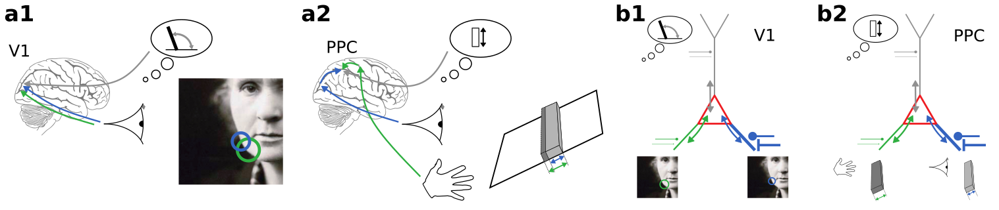

# Learning Bayes-optimal dendritic opinion pooling

This repository contains data and analysis scripts to reproduce the figures as well as source code and simulation scripts to perform the experiments described in [1].

<div style="text-align:center"></div>

<sub>__Dendritic opinion weighting as a canonical neuronal operation across cortex__.
(a1) Cue integration in early visual perception judging the orientation of a local edge. (a2) Cue integration in multimodal
perception judging the height of a bar [2]. (b1) Dendritic opinion weighting of visual cues combining information across receptive fields. (b2) Dendritic opinion weighting of multisensory cues combining information across modalities. This probabilistic computation is realized by the bidirectional voltage propagation in cortical neurons (colored arrows) that settles at the pooled somatic opinion (red triangle). The somatic voltage represents the reliability-weighted dendritic opinions (grey, green, blue), calculated by a biophysical "consensus finding".
Figure from [1].</sub>

This repository is organized as follows:

- `figures` contains scripts to reproduce all figures
- `data` contains data to reproduce all figures
- `experiments` contains scripts to perform the described experiments

# Prepare your Python environment

Our scripts rely on a few Python packages that you might need to install. These are specified in `requirements.txt`. You can conveniently install them via pip:
```bash
pip install -r requirements.txt
```

# Reproduce figures

To reproduce figures we provide a Makefile. Reproducing all figures is as easy as
```bash
cd figures
make all
```

You can reproduce a specific figure, e.g., figure 4 with
```bash
cd figures
make fig4
```

# Run experiments yourself

You can run the described experiments yourself. This (re)generates the data used by the figure generation scripts.
To generate the data we provide a Makefile. Generating all data is as easy as
```bash
cd experiments
make all
```

You can generate data for a specific figure, e.g., figure 4 with
```bash
cd experiments
make fig4
```

## References
[1] Jordan, J., Sacramento, J., Wybo, W.A., Petrovici, A.M., & Senn, W. (2021). Learning Bayes-optimal dendritic opinion pooling. arXiv preprint arXiv:2104.13238.

[2] Ernst, M. O., & Banks, M. S. (2002). Humans integrate visual and haptic information in a statistically optimal fashion. Nature, 415(6870), 429-433.
